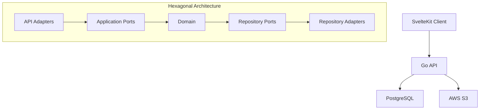

# Recorderis - Memories App


## Overview

Recorderis is a digital memory app designed to help users organize and maintain personal digital memories. The application allows users to upload multiple photos from events, write stories and descriptions about those moments, categorize memories, and tag locations.

## Tech Stack

### Backend

- **Language**: Go
- **Database**: PostgreSQL
- **Storage**: AWS S3 (for image storage)
- **Architecture**: Hexagonal Architecture

### Frontend

- **Framework**: SvelteKit
- **Styling**: TailwindCSS

## Architecture



## Project Structure

The project follows a hexagonal architecture (also known as ports and adapters) pattern:

- **API Layer**: Entry points for the application
- **Domain Layer**: Core business logic
- **Adapters**: Implementation of external interfaces
- **Ports**: Interfaces that define how the application interacts with external systems

```bash
├── api          # API endpoints and documentation
├── cmd          # Main application entry points
├── deploy       # Deployment configurations
├── documents    # Project documentation
└── internals    # Internal packages and utilities
```

## Getting Started

### Prerequisites

- Go 1.21+
- PostgreSQL
- AWS S3 account (or use local storage for development)

### Installation

```bash
# Clone the repository
git clone https://github.com/emutis21/recorderis-be.git
cd recorderis-be

# Install dependencies
go mod download

# Run the application
go run cmd/main.go
```

### Docker Setup

```bash
# Start the application using Docker Compose
docker-compose -f deploy/docker/docker-compose.yml up -d
```

## API Endpoints

```bash
# Authentication
POST   /auth/register
POST   /auth/login
POST   /auth/refresh
DELETE /auth/logout

# Memories
GET    /memories           # List memories (paginated)
POST   /memories           # Create memory
GET    /memories/:id       # Get memory details
PATCH  /memories/:id       # Update memory
DELETE /memories/:id       # Soft delete memory

# Photos
POST   /memories/:id/photos    # Upload photos
GET    /memories/:id/photos    # List photos
DELETE /memories/:id/photos/:photoId

# Sharing
POST   /memories/:id/share     # Share memory
GET    /memories/:id/shares    # List shares
DELETE /memories/:id/shares/:userId

# Tags
GET    /tags              # List all tags
POST   /tags              # Create tag
DELETE /tags/:id          # Delete tag
```

## Contributing

We follow a feature-branch workflow. Direct pushes to the main branch are not allowed.

1. Fork the repository
2. Create a feature branch (`git checkout -b feat/amazing-feature`)
3. Commit your changes (`git commit -m 'Add some amazing feature'`)
4. Push to the branch (`git push origin feat/amazing-feature`)
5. Open a Pull Request

Repository: [https://github.com/emutis21/recorderis-be](https://github.com/emutis21/recorderis-be)

## License

This project is licensed under the MIT License - see the LICENSE file for details.
