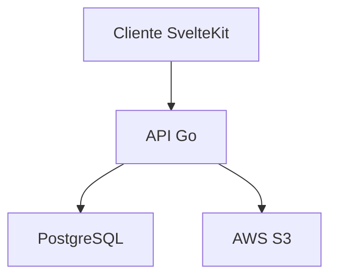
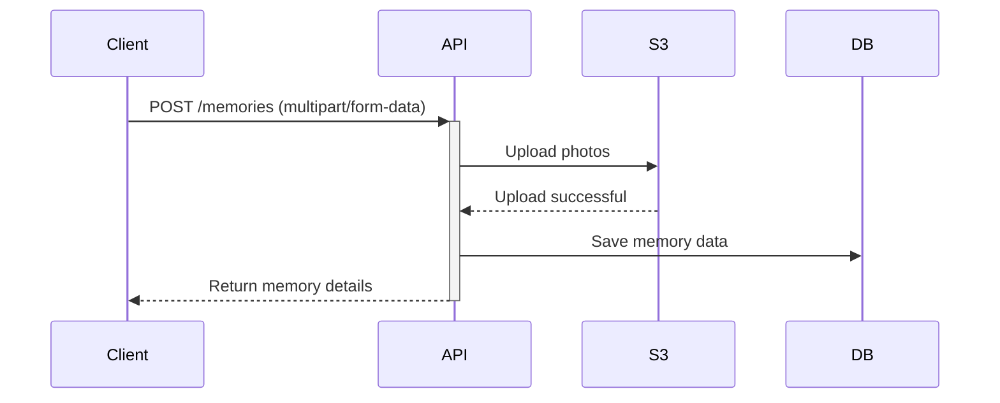

# System Design Document

## 1. Architecture Overview

### Key Questions

- ¿Cómo se comunicarán frontend y backend?
   - API REST

- ¿Qué patrones de diseño usaremos?
   - clean arquitecture

- ¿Cómo manejaremos el almacenamiento de imágenes?
   - S3

- ¿Cómo escalaremos la aplicación?

### Components



## 2. Database Design

### Entity Relationship Diagram

- código tablas iniciales DBML

```tsx
Enum user_role {
  admin
  user
}

Enum permission_level {
  read
  write
  admin
}

Table users {
  id integer [primary key, increment]
  user_id uuid [unique, not null, default: 'uuid_generate_v4()']
  username varchar(255) [not null]
  display_name varchar(255) [not null]
  avatar_url varchar(255)
  email varchar(255) [unique, not null]
  password_hash varchar(255) [not null]
  role user_role [not null, default: 'user']
  created_at timestamp [default: 'now()', not null]
  deleted_at timestamp [null]
  updated_at timestamp [default: 'now()', not null]
}

Table memories {
  id integer [primary key, increment]
  memory_id uuid [unique, not null, default: 'uuid_generate_v4()']
  user_id uuid [ref: > users.user_id, not null]
  title varchar(255) [not null]
  date timestamp [not null]
  created_at timestamp [default: 'now()', not null]
  deleted_at timestamp [null]
  is_public boolean [default: false, not null] 
}

Table descriptions {
  id integer [primary key, increment]
  description_id uuid [unique, not null, default: 'uuid_generate_v4()']
  memory_id uuid [ref: > memories.memory_id, not null]
  text text [not null]
  created_at timestamp [default: 'now()', not null]
  deleted_at timestamp [null]
  version integer [default: 1, not null] 
}

Table photos {
  id integer [primary key, increment]
  photo_id uuid [unique, not null, default: 'uuid_generate_v4()']
  memory_id uuid [ref: > memories.memory_id, not null]
  filename varchar(255) [not null]
  url varchar(255) [not null]
  display_order integer [default: 0, not null]
  uploaded_at timestamp [default: 'now()', not null]
  deleted_at timestamp [null]
}

Table tags {
  id integer [primary key, increment]
  tag_id uuid [unique, not null, default: 'uuid_generate_v4()']
  name varchar(255) [unique, not null]
  created_at timestamp [default: 'now()', not null]
  deleted_at timestamp [null]
}

Table memory_tags {
  memory_id uuid [ref: > memories.memory_id, not null]
  tag_id uuid [ref: > tags.tag_id, not null]
  created_at timestamp [default: 'now()', not null]
  deleted_at timestamp [null]
  
  indexes {
    (memory_id, tag_id) [unique]
  }
}

Table locations {
  id integer [primary key, increment]
  location_id uuid [unique, not null, default: 'uuid_generate_v4()']
  location varchar(255) [not null]
  longitude decimal(10, 7) [not null]
  latitude decimal(10, 7) [not null]
  city varchar(255) [not null]
  country varchar(255) [not null]
  created_at timestamp [default: 'now()', not null]
  deleted_at timestamp [null]
}

Table memory_locations {
  memory_id uuid [ref: > memories.memory_id, not null]
  location_id uuid [ref: > locations.location_id, not null]
  created_at timestamp [default: 'now()', not null]
  deleted_at timestamp [null]
  
  indexes {
    (memory_id, location_id) [unique]
  }
}

Table memory_shares {
  id integer [primary key, increment]
  memory_id uuid [ref: > memories.memory_id, not null]
  shared_with_user_id uuid [ref: > users.user_id, not null]
  permission_level permission_level [not null, default: 'read']
  created_at timestamp [default: 'now()', not null]
  deleted_at timestamp [null]
  
  indexes {
    (memory_id, shared_with_user_id) [unique]
  }
}
```

- código tablas iniciales SQL

```sql
CREATE TYPE "user_role" AS ENUM (
  'admin',
  'user'
);

CREATE TYPE "permission_level" AS ENUM (
  'read',
  'write',
  'admin'
);

CREATE TABLE "users" (
  "id" INTEGER GENERATED BY DEFAULT AS IDENTITY PRIMARY KEY,
  "user_id" uuid UNIQUE NOT NULL DEFAULT 'uuid_generate_v4()',
  "username" varchar(255) NOT NULL,
  "display_name" varchar(255) NOT NULL,
  "avatar_url" varchar(255),
  "email" varchar(255) UNIQUE NOT NULL,
  "password_hash" varchar(255) NOT NULL,
  "role" user_role NOT NULL DEFAULT 'user',
  "created_at" timestamp NOT NULL DEFAULT 'now()',
  "deleted_at" timestamp,
  "updated_at" timestamp NOT NULL DEFAULT 'now()'
);

CREATE TABLE "memories" (
  "id" INTEGER GENERATED BY DEFAULT AS IDENTITY PRIMARY KEY,
  "memory_id" uuid UNIQUE NOT NULL DEFAULT 'uuid_generate_v4()',
  "user_id" uuid NOT NULL,
  "title" varchar(255) NOT NULL,
  "date" timestamp NOT NULL,
  "created_at" timestamp NOT NULL DEFAULT 'now()',
  "deleted_at" timestamp,
  "is_public" boolean NOT NULL DEFAULT false
);

CREATE TABLE "descriptions" (
  "id" INTEGER GENERATED BY DEFAULT AS IDENTITY PRIMARY KEY,
  "description_id" uuid UNIQUE NOT NULL DEFAULT 'uuid_generate_v4()',
  "memory_id" uuid NOT NULL,
  "text" text NOT NULL,
  "created_at" timestamp NOT NULL DEFAULT 'now()',
  "deleted_at" timestamp,
  "version" integer NOT NULL DEFAULT 1
);

CREATE TABLE "photos" (
  "id" INTEGER GENERATED BY DEFAULT AS IDENTITY PRIMARY KEY,
  "photo_id" uuid UNIQUE NOT NULL DEFAULT 'uuid_generate_v4()',
  "memory_id" uuid NOT NULL,
  "filename" varchar(255) NOT NULL,
  "url" varchar(255) NOT NULL,
  "display_order" integer NOT NULL DEFAULT 0,
  "uploaded_at" timestamp NOT NULL DEFAULT 'now()',
  "deleted_at" timestamp
);

CREATE TABLE "tags" (
  "id" INTEGER GENERATED BY DEFAULT AS IDENTITY PRIMARY KEY,
  "tag_id" uuid UNIQUE NOT NULL DEFAULT 'uuid_generate_v4()',
  "name" varchar(255) UNIQUE NOT NULL,
  "created_at" timestamp NOT NULL DEFAULT 'now()',
  "deleted_at" timestamp
);

CREATE TABLE "memory_tags" (
  "memory_id" uuid NOT NULL,
  "tag_id" uuid NOT NULL,
  "created_at" timestamp NOT NULL DEFAULT 'now()',
  "deleted_at" timestamp
);

CREATE TABLE "locations" (
  "id" INTEGER GENERATED BY DEFAULT AS IDENTITY PRIMARY KEY,
  "location_id" uuid UNIQUE NOT NULL DEFAULT 'uuid_generate_v4()',
  "location" varchar(255) NOT NULL,
  "longitude" decimal(10,7) NOT NULL,
  "latitude" decimal(10,7) NOT NULL,
  "city" varchar(255) NOT NULL,
  "country" varchar(255) NOT NULL,
  "created_at" timestamp NOT NULL DEFAULT 'now()',
  "deleted_at" timestamp
);

CREATE TABLE "memory_locations" (
  "memory_id" uuid NOT NULL,
  "location_id" uuid NOT NULL,
  "created_at" timestamp NOT NULL DEFAULT 'now()',
  "deleted_at" timestamp
);

CREATE TABLE "memory_shares" (
  "id" INTEGER GENERATED BY DEFAULT AS IDENTITY PRIMARY KEY,
  "memory_id" uuid NOT NULL,
  "shared_with_user_id" uuid NOT NULL,
  "permission_level" permission_level NOT NULL DEFAULT 'read',
  "created_at" timestamp NOT NULL DEFAULT 'now()',
  "deleted_at" timestamp
);

CREATE UNIQUE INDEX ON "memory_tags" ("memory_id", "tag_id");

CREATE UNIQUE INDEX ON "memory_locations" ("memory_id", "location_id");

CREATE UNIQUE INDEX ON "memory_shares" ("memory_id", "shared_with_user_id");

ALTER TABLE "memories" ADD FOREIGN KEY ("user_id") REFERENCES "users" ("user_id");

ALTER TABLE "descriptions" ADD FOREIGN KEY ("memory_id") REFERENCES "memories" ("memory_id");

ALTER TABLE "photos" ADD FOREIGN KEY ("memory_id") REFERENCES "memories" ("memory_id");

ALTER TABLE "memory_tags" ADD FOREIGN KEY ("memory_id") REFERENCES "memories" ("memory_id");

ALTER TABLE "memory_tags" ADD FOREIGN KEY ("tag_id") REFERENCES "tags" ("tag_id");

ALTER TABLE "memory_locations" ADD FOREIGN KEY ("memory_id") REFERENCES "memories" ("memory_id");

ALTER TABLE "memory_locations" ADD FOREIGN KEY ("location_id") REFERENCES "locations" ("location_id");

ALTER TABLE "memory_shares" ADD FOREIGN KEY ("memory_id") REFERENCES "memories" ("memory_id");

ALTER TABLE "memory_shares" ADD FOREIGN KEY ("shared_with_user_id") REFERENCES "users" ("user_id");
```


## 3. API Endpoints

### Consideraciones

- ¿Qué formato de respuesta usaremos?
   - JSON

- ¿Cómo manejaremos la paginación?
   - GET /memories?page=2&per_page=10

- ¿Qué estructura de URLs seguiremos?
   - https://api.memoryapp.com/v1?

### Endpoints Base

```sh
Authentication Endpoints

POST   /auth/register
POST   /auth/login
POST   /auth/refresh
DELETE /auth/logout

Memories Endpoints

GET    /memories           # List memories (paginated)
POST   /memories           # Create memory
GET    /memories/:id       # Get memory details
PATCH  /memories/:id       # Update memory
DELETE /memories/:id       # Soft delete memory

POST   /memories/:id/photos    # Upload photos
GET    /memories/:id/photos    # List photos
DELETE /memories/:id/photos/:photoId

POST   /memories/:id/share     # Share memory
GET    /memories/:id/shares    # List shares
DELETE /memories/:id/shares/:userId

Tags Endpoints

GET    /tags              # List all tags
POST   /tags              # Create tag
DELETE /tags/:id          # Delete tag

```

## 4. Security Architecture

- Authentication flow
- Authorization levels
- Data encryption
- File upload security

## 5. Sequence Diagrams

### Upload Memory Flow



## 6. Non-Functional Requirements

- Performance targets
- Scalability considerations
- Security requirements
- Monitoring strategy